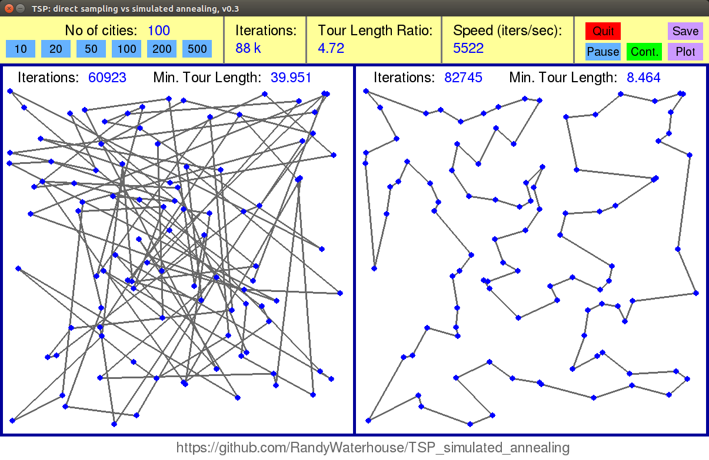

# TSP_simulated_annealing

Here I provide a Python 2.7 code which determines approximate solutions to the Travelling Salesman Problem (TSP) by direct sampling and by simulated annealing. The progress of the two solutions is shown simultaneously in a pygame graphics window. There are several controls to pause/restart the simulation, save the current state as an image and produce a plot of minimal tour length versus iteration number.

The number of cities may be chosen from a pre-defined list (10, 20, 50, ...). If a new number of cities is selected, the simulation is restarted with that number of cities placed randomly on the map. 

For details on the method simulated annealing, see e.g. the Wiki article (https://en.wikipedia.org/wiki/Simulated_annealing).

Please feel free to download, run and modify the code. It requires Python 2.7, pygame, matplotlib and some standard packages like random, math, timeit, time, datetime.

Some keyboard shortcuts:
p: pause
c: continue
q, ESC: quit

Screenshot:

